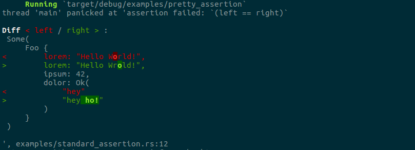

# Pretty Assertions

When writing tests in Rust, you'll probably use `assert_eq!(a, b)` _a lot_.
If such a test fails, it will present all the details of `a` and `b`, but you have to spot, the differences yourself, which is not always straightforward, like here:


Wouldn't that task be _much_ easier with a colorful diff?



Yes it would. And you only need **one line of code** to make it happen —
seriously:

```rust
// add the following line to the top of your crate root to
// overwrite `assert_eq!` with a colorful drop-in replacement
#[macro_use] extern crate pretty_assertions;
```

Ok, and don't forget to add the `pretty_assertions` dependency to `Cargo.toml`.
Does that count as a line of code?.. ;-)

## Note

* `pretty_assertions` is an ultra-thin wrapper around the
  [`difference`](https://crates.io/crates/difference) crate, which does
  the heavy lifting. It replaces the `assert_eq!` macro with just about 22
  lines of code.
* The replacement is only effective in your own crate, not in other libraries
  you include.

## Example

This is the Rust code behind the screenshots above.

```rust
// uncomment the next line to make the assertions colorful:
//#[macro_use] extern crate pretty_assertions;

fn main() {
    #[derive(Debug, PartialEq)]
    struct Foo {
        lorem: &'static str,
        ipsum: u32,
        dolor: Result<String, String>,
    }

    let x = Some(Foo { lorem: "Hello World!", ipsum: 42, dolor: Ok("hey".to_string())});
    let y = Some(Foo { lorem: "Hello Wrold!", ipsum: 42, dolor: Ok("hey ho!".to_string())});

    assert_eq!(x, y);
}
```

## License

Licensed under either of

- Apache License, Version 2.0, ([LICENSE-APACHE](LICENSE-APACHE) or <http://www.apache.org/licenses/LICENSE-2.0>)
- MIT license ([LICENSE-MIT](LICENSE-MIT) or <http://opensource.org/licenses/MIT>)

at your option.

### Contribution

Unless you explicitly state otherwise, any contribution intentionally
submitted for inclusion in the work by you, as defined in the Apache-2.0
license, shall be dual licensed as above, without any additional terms or
conditions.
